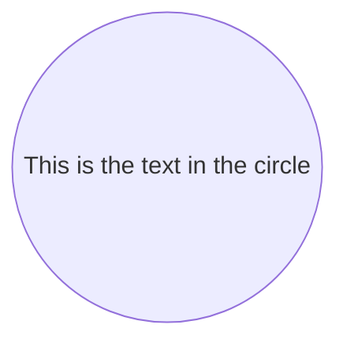
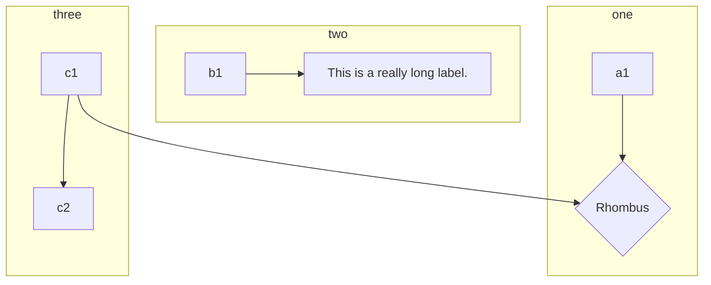

# WelcomeToSmartdown
---

## Welcome to Smartdown

Smartdown is an extension of Markdown that includes several additions:
- Technical notation support, including [MathJax](https://www.mathjax.org) LaTeX and AsciiMath syntax, chemical notation via [`mhchem`](https://mhchem.github.io/MathJax-mhchem/),
- Syntax highlighting via [highlight.js](https://highlightjs.org).
- Reactive cells similar to those in a spreadsheet, but inline with Smartdown prose. These cells can be used for input, output, calculation, and for interacting with internet APIs such as Wikidata.
- Media embedding support including Images, Tweets, SVG, Video.
- [p5.js](https://p5js.org) to support drawing-based visualizations, games, and sound.
- [Plotly.js](https://plot.ly/javascript/) to support data visualizations including various plots, charts, and maps.
- [Leaflet.js](http://leafletjs.com) for easy embedding of geo-based data and maps.
- [Graphviz via `viz.js`](http://viz-js.com) diagrams are a standard format used for technical and scientific diagrams
- Much MuchMuchMuchMuch more


### Map of functionality

Use the navigation buttons below to explore different aspects of Smartdown.

- [Math](:@Math)
- [Cells](:@Cells)
- [P5JS](:@P5JS)
- [SVG](:@SVG)
- [Mermaid](:@Mermaid)

Note that the above links are intra-document links in a MultiCard Smartdown document.

The links below, however, are inter-document links between one Smartdown document, and another. In both of these cases, no page-reload occurs and state is maintained.

[Smartdown Tour](:@/posts/ABriefTourOfSmartdown.md)
[Welcome To My Blog](:@/posts/WelcomeToMyBlog.md)

### GIF Example

I'm experimenting with incorporating GIFs for the purpose of building a tutorial. Below is a short video of the [Smartdown Viewer](https://smartdown.site) being used to edit Smartdown:


---

The source for this page is at [`/posts/ABriefTourOfSmartdown.md`](/posts/ABriefTourOfSmartdown.md).


# SVG
---

Smartdown allows SVG images to be registered and preprocessd so that they can be dynamically styled. For this example, we incorporate an SVG from [Wikimedia Hypercube](https://commons.wikimedia.org/wiki/File:Hypercube.svg).

We can use ordinary Markdown image syntax:


Or, we can use Smartdowns `/media` syntax and amend it with styling:

|hypercube|pulse|clockwise|cclockwise|bluegreen|
|:---:|:---:|:---:|:---:|:---:|
||||||
||||||

---

[Back to Home](:@WelcomeToSmartdown)


# Math
---

#### Math Example

By using MathJax, we can display all sorts of notation.

We can do inline math: $E = mc^2$

Or we can do block math:

$$
A \longrightarrow B
$$

$$
\begin{array}{c|lcr}
n & \text{Left} & \text{Center} & \text{Right} \\
\hline
1 & 0.24 & 1 & 125 \\
2 & -1 & 189 & -8 \\
3 & -20 & 2000 & 1+10i
\end{array}
$$

And even diagrams via *xyjax*:

$$
\begin{xy}
0;<1em,0em>:
(1,1);p+/v a(18) 5.5em/**@{-},
(1,3);p+/v a(18) 5.5em/**@2{-},
(1,5);p+/v a(18) 5.5em/**@3{-},
(1,9);p+/v a(18) 5.5em/**@{.},
(1,11);p+/v a(18) 5.5em/**@2{.},
(1,13);p+/v a(18) 5.5em/**@3{..},
\end{xy}
$$

#### MathJax $\LaTeX$ vs AsciiMath Syntax

Recently, I learned that MathJax had an alternative syntax, [AsciiMath](http://asciimath.org) that is simpler for many purposes. Smartdown has enabled this feature, although we are currently using `@` as the delimiter instead of \` or `$`.

##### $\LaTeX$ Syntax

Currently, Smartdown uses LaTeX-style math syntax, so the following formula:

$$
\sum_{i=1}^{n} i^3=\left(\frac{n(n+1)}{2}\right)^2
$$

is expressed as:

```
$$
\sum_{i=1}^{n} i^3=\left(\frac{n(n+1)}{2}\right)^2
$$
```

##### AsciiMath Syntax

The above formula is expressed in AsciiMath (using `@` as delimiters) as:

```
@sum_(i=1)^n i^3=((n(n+1))/2)^2@
```

which Smartdown now renders as:

@sum_(i=1)^n i^3=((n(n+1))/2)^2@

Note that AsciiMath via MathJax does not support *display-mode* equations, but centering can be achieved via Markdown table syntax:


|`@sum_(i=1)^n i^3=((n(n+1))/2)^2@`|
|:---:|
|@sum_(i=1)^n i^3=((n(n+1))/2)^2@|


---

[Back to Home](:@WelcomeToSmartdown)


# Mermaid
---

[Mermaid.js](https://mermaid-js.github.io/mermaid/#/) is a Javascript library that uses textual descriptions of diagrams and then renders these dynamically in the browser. From their site:

> mermaid is a Javascript based diagramming and charting tool. It generates diagrams flowcharts and more, using markdown-inspired text for ease and speed.

Smartdown has embraced Mermaid and makes it easy to embed Mermaid diagrams within prose.



---




We can do inline math: $E = mc^2$

---

[Back to Home](:@WelcomeToSmartdown)


# Cells
---


## Cells - Reactive Spreadsheet Cells

Smartdown uses ordinary Markdown link syntax to specify a cell *label* and *body*, where the *label* is specified in the link label, and the *body* is specified in the link's URL. For example, the following declares an *output* cell that displays the value of the `FOO` variable:

```markdown
[The value of FOO is](:!FOO)
```

When a non-empty label is present, the cell will be formatted with its label on its own line. When no label is present, then the cell will be formatted inline.

### Cells with labels get their own line

- [What is your name?](:?NAME)
- [Glad to meet you](:!NAME)
- [What is your name again?](:?NAME)
- [Really glad to meet you](:!NAME)
- [Are you human?](:XHUMAN)
- [Humanity](:!HUMAN)


### Cells with no labels are inlined

What is your name? [](:?NAME) So glad to meet you [](:!NAME). What is your name again? [](:?NAME) Really glad to meet you [](:!NAME).
Are you human? [](:XHUMAN) Your Humanity is [](:!HUMAN).


### External Data Query

*The Smartdown code below is a work in progress and the syntax used is experimental and in flux.*

One of the goals of Smartdown is to enable simple text files to express rich interactive experiences that involve live data. Ideally, web-based services would already exist to serve the data-hunger of Smartdown. In this example, we are exploring the use of [Wikidata](https://www.wikidata.org) as a data source.

Limitations of the current tech include:

- The [Falcor](https://netflix.github.io/falcor/) syntax is a hack and is not using the Falcor library.
- The current example emphasizes the extraction of thumbnail images from Wikidata and does not display or utilize the full set of metadata returned.

[WHAT do you want to look up?](:?WHAT)

Examples:
- Earth
- Penguin
- Uranium
- Oregon
- Abraham Lincoln
- [`WHAT`](:=LOOKUP=/wikidata["`WHAT`"])
- [`WHAT` thumbnails](:=LOOKUP=/wikidataThumbs["`WHAT`"])
- [`WHAT` images](:=LOOKUP=/wikidataImages["`WHAT`"])


- [Albert Einstein|Marie Curie|Max Plank (Slash, Thumbnails)](:=LOOKUP=/wikidataThumbs/Albert%20Einstein|Marie%20Curie|Max%20Plank)
- [Albert Einstein (Falcor, Thumbnails)](:=LOOKUP=/wikidataThumbs["Albert%20Einstein"])
- [Albert Einstein|Marie Curie|Max Plank (Slash, Original)](:=LOOKUP=/wikidataImages/Albert%20Einstein|Marie%20Curie|Max%20Plank)
- [Albert Einstein (Falcor, Original)](:=LOOKUP=/wikidataImages["Albert%20Einstein"])
- [Lookup result](:!LOOKUP)

---

[](:!LOOKUP)

---

[Back to Home](:@WelcomeToSmartdown)


# P5JS
---

## P5JS Experiments

Here's a small set of what is possible with Smartdown and [p5.js](https://p5js.org).

More examples can be seen at [smartdown.site](https://smartdown.site).

The Ellipse example below is an `/autoplay` playable. You can click `Stop` to see its source. The subsequent `Tickle` playable is not `/autoplay`, so you will click `Play` to play it.

### P5JS Ellipse Example

```p5js /playable/autoplay
p5.setup = function() {
};

p5.draw = function() {
  p5.ellipse(50, 50, 80, 80);
};
```

##### Tickle example with Instance mode Syntax

```p5js/playable
var message = "tickle",
  font,
  bounds, // holds x, y, w, h of the text's bounding box
  fontsize = 60,
  x, y; // x and y coordinates of the text

p5.preload = function preload() {
  font = p5.loadFont('https://unpkg.com/smartdown-gallery/resources/SourceSansPro-Regular.otf');
};

p5.setup = function setup() {
  p5.createCanvas(410, 250);

  // set up the font
  p5.textFont(font);
  p5.textSize(fontsize);

  // get the width and height of the text so we can center it initially
  bounds = font.textBounds(message, 0, 0, fontsize);
  x = p5.width / 2 - bounds.w / 2;
  y = p5.height / 2 - bounds.h / 2;
};

p5.draw = function draw() {
  p5.background(204, 120);

  // write the text in black and get its bounding box
  p5.fill(0);
  p5.text(message, x, y);
  bounds = font.textBounds(message,x,y,fontsize);

  // check if the mouse is inside the bounding box and tickle if so
  if ( p5.mouseX >= bounds.x && p5.mouseX <= bounds.x + bounds.w &&
    p5.mouseY >= bounds.y && p5.mouseY <= bounds.y + bounds.h) {
    x += p5.random(-5, 5);
    y += p5.random(-5, 5);
  }
};
```

---

[Back to Home](:@WelcomeToSmartdown)
